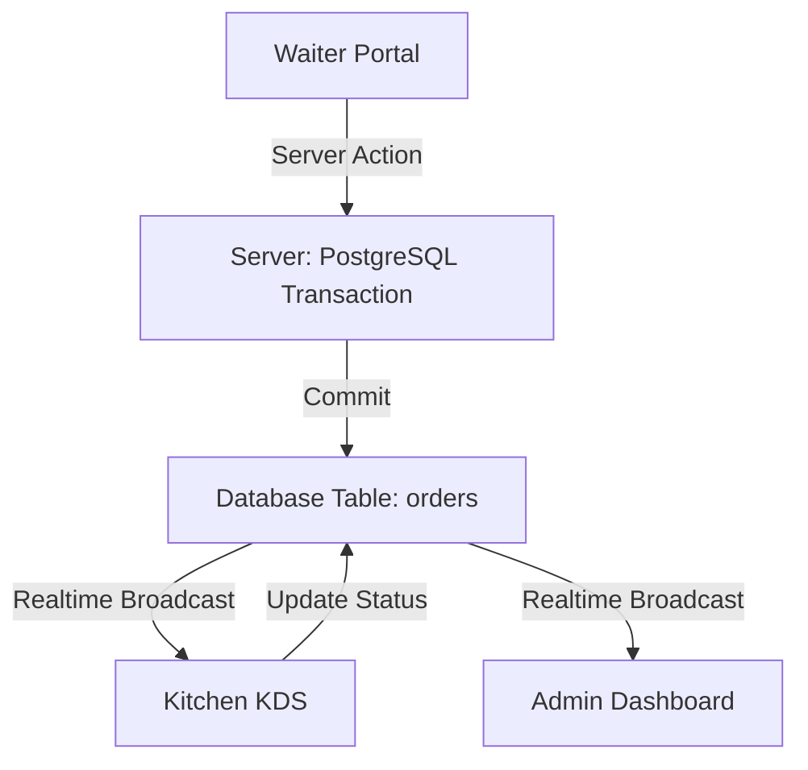

# 🏗️ Architecture Blueprint — JAMALI OS
> **Versión:** 1.2 (SaaS Modular)
> **Stack:** Next.js 15 (App Router) + Supabase + PostgreSQL (Direct Access)

---

## 1. Visión General
JAMALI OS es una plataforma **Multi-tenant** diseñada para baja latencia. El núcleo del sistema utiliza **Supabase Realtime** para sincronizar pedidos entre meseros y cocina sin necesidad de recargar la página.

## 2. El Stack Tecnológico
*   **Frontend**: Next.js 15, Tailwind CSS, Lucide React (Iconos), Shadcn UI (Componentes).
*   **Estado & Realtime**: React Hooks (`useState`, `useEffect`) combinados con suscripciones de Supabase.
*   **Base de Datos**: PostgreSQL alojado en Supabase.
*   **Lógica de Servidor**: Server Actions (Next.js) para la mayoría de operaciones.

## 3. Patrón de Acceso a Datos (Híbrido)
Para garantizar la integridad en operaciones complejas, JAMALI OS utiliza dos capas de acceso:

1.  **Capa Supabase (Client-Side)**:
    *   Usada para lecturas rápidas (`SELECT`) y actualizaciones simples.
    *   Respeta las políticas **RLS (Row Level Security)**.
    *   Ideal para el mapa de mesas y lista de productos.

2.  **Capa PG Direct (Server-Side - `pg` library)**:
    *   Ubicación: `src/actions/orders-fixed.ts`.
    *   **Propósito**: Bypass de RLS controlado y soporte de **Transacciones SQL**.
    *   **Por qué se usa**: Operaciones como el **Split Check** o **Merge Tables** requieren modificar múltiples tablas simultáneamente. Si una operación falla, el sistema hace un `ROLLBACK` automático para no corromper la cuenta.

## 4. Flujo de Sincronización Realtime

## 5. Performance Tips
*   **Imágenes**: Usar el componente `<Image />` de Next.js para optimizar fotos de platos cargadas por el usuario.
*   **Conexiones**: El `Pool` de conexiones en las Server Actions está diseñado para ser reutilizado (`client.release()`), evitando saturar los límites de Supabase.

---
> [!CAUTION]
> No modificar el archivo `src/actions/orders-fixed.ts` sin comprender el manejo de transacciones bancarias, ya que podrías duplicar ítems en una factura.
