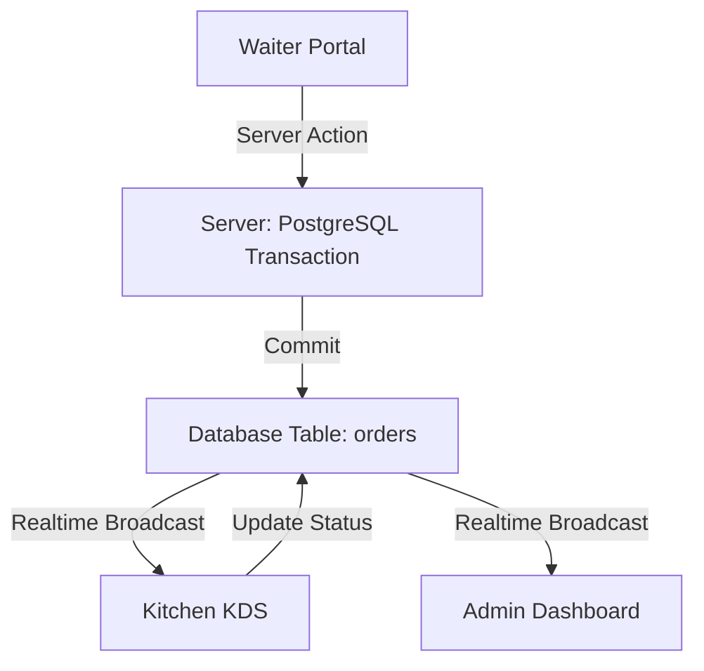

# 🏗️ Architecture Blueprint — JAMALI OS
> **Versión:** 1.2 (SaaS Modular)
> **Stack:** Next.js 15 (App Router) + Supabase + PostgreSQL (Direct Access)

---

## 1. Visión General
JAMALI OS es una plataforma **Multi-tenant** diseñada para baja latencia. El núcleo del sistema utiliza **Supabase Realtime** para sincronizar pedidos entre meseros y cocina sin necesidad de recargar la página.

## 2. El Stack Tecnológico
*   **Frontend**: Next.js 15, Tailwind CSS, Lucide React (Iconos), Shadcn UI (Componentes).
*   **Estado & Realtime**: React Hooks (`useState`, `useEffect`) combinados con suscripciones de Supabase.
*   **Base de Datos**: PostgreSQL alojado en Supabase.
*   **Lógica de Servidor**: Server Actions (Next.js) para la mayoría de operaciones.

## 3. Patrón de Acceso a Datos (Híbrido)
Para garantizar la integridad en operaciones complejas, JAMALI OS utiliza dos capas de acceso:

1.  **Capa Supabase (Client-Side)**:
    *   Usada para lecturas rápidas (`SELECT`) y actualizaciones simples.
    *   Respeta las políticas **RLS (Row Level Security)**.
    *   Ideal para el mapa de mesas y lista de productos.

2.  **Capa PG Direct (Server-Side - `pg` library)**:
    *   Ubicación: `src/actions/orders-fixed.ts`.
    *   **Propósito**: Bypass de RLS controlado y soporte de **Transacciones SQL**.
    *   **Por qué se usa**: Operaciones como el **Split Check** o **Merge Tables** requieren modificar múltiples tablas simultáneamente. Si una operación falla, el sistema hace un `ROLLBACK` automático para no corromper la cuenta.

## 4. Flujo de Sincronización Realtime

## 5. Perímetro de Seguridad (Edge & Network)
JAMALI OS implementa un escudo de Pen Testing diseñado para resistir ataques externos de fuerza bruta y suplantación:
*   **Edge Middleware (`src/middleware.ts`)**: Ejecuta un "Rate Limiter" asíncrono que bloquea IPs maliciosas y valida la vigencia del JWT perimetralmente antes de que la petición toque la base de datos o renderice la UI.
*   **Strict CORS & Security Headers**: Configurado nativamente en `next.config.ts`, el sistema blinda la app con cabeceras `X-Frame-Options`, `Strict-Transport-Security` y políticas CORS restrictivas para las APIs, previniendo ataques de Clickjacking y Cross-Site Scripting (XSS).

## 6. Resiliencia Offline (PWA)
Para operar ininterrumpidamente en entornos de restaurante del mundo real (donde el WiFi puede fallar), el sistema ha sido convertido en una **Progressive Web App (PWA)**:
*   Utiliza `@ducanh2912/next-pwa` para registrar un **Service Worker** (`sw.js`).
*   Mantiene en caché los assets de la Interfaz de Usuario. Si cae la red, la caja registradora, el KDS y el portal de meseros evitan la pantalla del "dinosaurio de Chrome" y permanecen estables.

## 7. Performance Tips
*   **Imágenes**: Usar el componente `<Image />` de Next.js para optimizar fotos de platos cargadas por el usuario.
*   **Conexiones**: El `Pool` de conexiones en las Server Actions está diseñado para ser reutilizado (`client.release()`), evitando saturar los límites de Supabase.

## 6. Patrón de Refactorización Atómica (SaaS Enterprise Standard)
Para mantener la escalabilidad y permitir que múltiples desarrolladores trabajen en el mismo módulo sin conflictos masivos, JAMALI OS sigue un **Patrón de Refactorización Atómica**:

1.  **Límite de Líneas (LOC)**: Los archivos de página principal (`page.tsx`) deben mantenerse por debajo de **150-200 líneas**.
2.  **Extracción de Tipos**: Todos los interfaces y tipos específicos del módulo deben residir en un archivo `types.ts` dentro de la carpeta del módulo (ej: `src/app/admin/orders/types.ts`).
3.  **Componentes Discretos**: La UI debe fragmentarse en componentes lógicos situados en `src/components/admin/[module_name]/`.
    *   Ejemplo: `RevenueCore.tsx`, `InventoryTable.tsx`, `Sidebar.tsx`.
4.  **Orquestación**: El archivo `page.tsx` sólo debe encargarse de:
    *   Fecthing de datos inicial (vía hooks o server components).
    *   Gestión de estados globales del módulo.
    *   Renderizado de los componentes extraídos pasando las props necesarias.

---
> [!CAUTION]
> No modificar el archivo `src/actions/orders-fixed.ts` sin comprender el manejo de transacciones bancarias, ya que podrías duplicar ítems en una factura.
