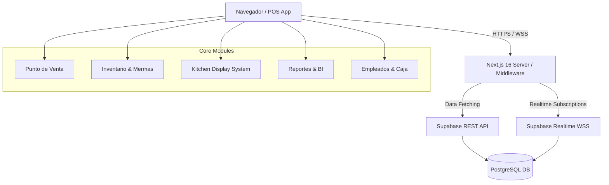
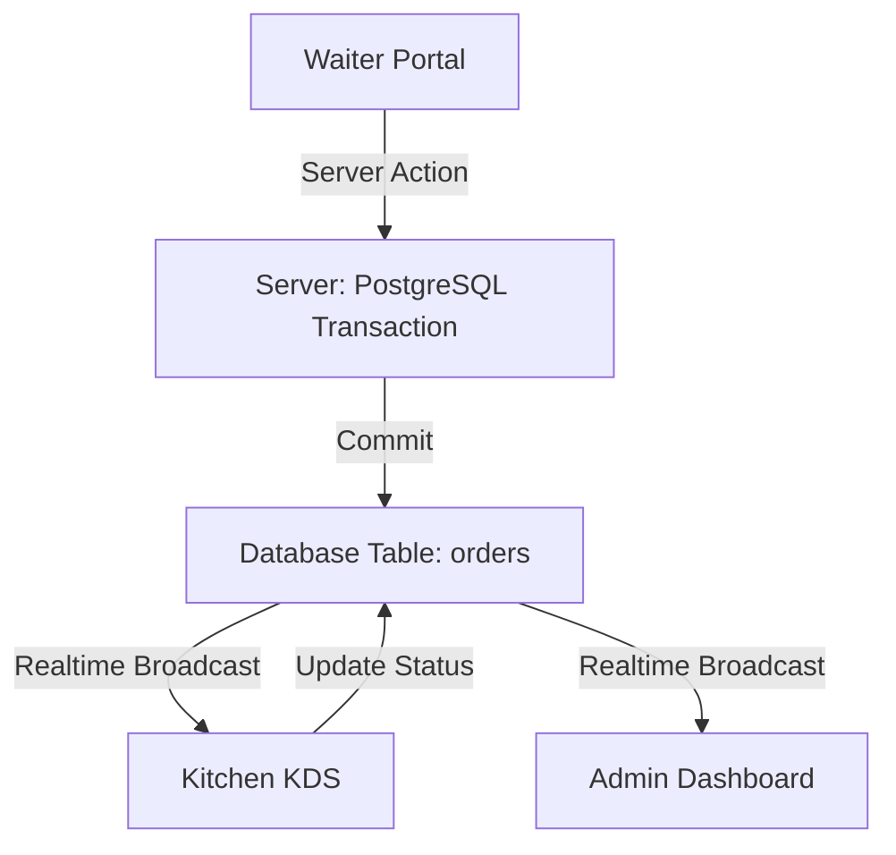

# Arquitectura del Sistema - JAMALI OS

Este documento describe la arquitectura a alto nivel de JAMALI OS, su estructura de directorios, las tecnologías involucradas y cómo interactúan las diferentes capas de la aplicación. Su propósito es permitir a cualquier desarrollador nuevo (o inversor/comprador) entender el sistema en menos de 1 hora.

## 1. ¿Qué hace el sistema?
JAMALI OS es un sistema integral de punto de venta (POS) y ERP especializado en el sector gastronómico (restaurantes, bares, cafeterías). Está diseñado con una arquitectura **Multi-Tenant (Multi-inquilino)**, lo que significa que un solo despliegue puede servir a múltiples restaurantes, manteniendo los datos estricta y criptográficamente aislados.

## 2. Tecnologías y Stack (Tech Stack)
*   **Frontend / Framework:** [Next.js 16 (App Router)](https://nextjs.org/) + [React 19](https://react.dev/)
*   **Lenguaje:** [TypeScript](https://www.typescriptlang.org/) (Strict Mode)
*   **Estilos y UI:** [Tailwind CSS v4](https://tailwindcss.com/) + [Framer Motion](https://www.framer.com/motion/) (Animaciones fluidas) + [Shadcn UI](https://ui.shadcn.com/)
*   **Backend & Base de Datos:** [Supabase](https://supabase.com/) (PostgreSQL 15)
*   **Autenticación:** Supabase Auth (Email/Password, Roles basados en Base de Datos)
*   **Visualización de Datos:** [Recharts](https://recharts.org/) (Reportes financieros)

---

## 3. Diagrama del Sistema (Flujo de Datos)



---

## 4. Estructura de Directorios (Clean Folder Structure)
Siguiendo las mejores prácticas de mantenibilidad y modularidad, el proyecto está estructurado de la siguiente forma:

```text
/JAMALISO
├── /docs                    # Documentación del proyecto (DB, Arquitectura, Flujos)
├── /scripts                 # Scripts en SQL para migración, despliegue y fixes
│
├── /src                     # Código Fuente Principal
│   ├── /actions             # Server Actions (Lógica segura del backend en Next.js)
│   ├── /app                 # App Router de Next.js (Rutas, páginas, layouts)
│   │   ├── /admin           # Backoffice & POS (Carpeta principal del software)
│   │   ├── /login           # Autenticación
│   │   └── api              # Endpoints API Route
│   │
│   ├── /components          # Componentes visuales genéricos y de dominio (Botones, Modales)
│   │   ├── /admin           # Componentes específicos del POS y Backoffice
│   │   │   └── /waiter      # Componentes atómicos del Portal de Meseros
│   │   └── /ui              # Componentes UI base (Shadcn/Tailwind)

│   │
│   ├── /lib                 # Lógica core compartida
│   │   ├── /supabase        # Clientes Supabase (Server / Browser / Middleware)
│   │   └── utils.ts         # Funciones puras (Formateos, cálculos estadísticos)
│   │
│   ├── /providers           # Context Providers (Global State)
│   │   └── RestaurantProvider.tsx # Manejo de contexto del Tenant actual
│   │
│   └── /types               # Definiciones de TypeScript e Interfaces
```

---

## 5. Módulos Principales
La aplicación se divide en áreas funcionales cohesionadas.

| Módulo | Descripción | Frontend Path |
| :--- | :--- | :--- |
| **Partner Master Hub** | Gestión de socios B2B, resellers y red de marca blanca. | `/src/app/admin/partners` |
| **Punto de Venta (POS)** | Creación de comandas, mesas, delivery y pagos. | `/src/app/admin/pos` y `/admin/waiter` |
| **Kitchen Display (KDS)** | Pantalla para cocina, tiempos de preparación y estados. | `/src/app/admin/kitchen` |
| **Gestión de Inventario** | Entradas, salidas, alertas de stock mínimo y proveedores. | `/src/app/admin/inventory/*` |
| **Recetas y Producción** | Base para el cálculo de Food Cost (rendimientos, mermas). | `/src/app/admin/inventory/recipes` |
| **Cajas y Turnos** | Control de efectivo, descuadres. Soporta **Traspaso de Turno** (Handoff) con mesas pendientes y firma digital. | `/src/app/admin/cashier/*` |
| **Pedidos QR** | Menú digital con pedidos directos desde la mesa vinculados al KDS. | `/src/app/[slug]/mesa/[mesa]` |
| **Reportes y B.I.** | Inteligencia de negocios, proyecciones IA, márgenes. | `/src/app/admin/reports` |
| **Identidad Visual** | Configuración dinámica de marca blanca (logos, colores). | `/src/app/admin/settings` |
| **Nómina (Payroll)** | Gestión de sueldos, contratos, comisiones e impuestos. | `/src/app/admin/payroll` |
| **Ventas Online Central** | Activación web, modo e-commerce/menú, SEO y redes. | `/src/app/admin/online-sales` |

---

## 6. Seguridad (Row Level Security)
JAMALISO delega el aislamiento de datos a nivel de base de datos usando **PostgreSQL Row Level Security (RLS)**.
Todas las consultas hechas por el cliente pasan por políticas estrictas que validan:
1. El usuario está autenticado.
2. El rol del usuario permite la acción (`admin`, `owner`, `waiter`, `kitchen`).
3. El registro consultado pertenece ÚNICAMENTE al identificador del inquilino (`restaurant_id`).

Esto hace que sea criptográficamente imposible que el restaurante A consulte las ventas o inventario del restaurante B.

---

## 7. Esquema de Datos — Nómina y Regionalización (Novedad 2026)
JAMALISO ahora integra un motor ERP para la gestión de talento humano y adaptación global.

### A. Configuración Regional
*   **Moneda:** Adaptación dinámica vía `formatPrice`.
*   **Impuestos:** Tabla `regional_taxes` (IVA, Impoconsumo, Sales Tax) vinculada al país.

### B. Módulo de Nómina (Payroll Engine)
*   **Profiles (Staff):** Sueldo base, % comisiones, tipo de contrato.
*   **Concepts:** Catálogo de devengados (Earning) y deducciones (Deduction).
*   **Comisiones:** Automatizadas mediante el trigger `process_sale_commission` en ventas POS.
*   **Novedades:** Registro de pagos extras, mermas o préstamos en `payroll_novelties`.

---

## 8. Onboarding Automático y Pagos (Wizard)
JAMALI OS cuenta con un asistente de configuración inteligente (`Wizard`) a nivel de aplicación (`/register/wizard`):
1.  **Información del Restaurante:** Nombre, branding (Logo/Colores), tipo de cocina.
2.  **Configuración de Mesas:** Creación visual del salón y asignación de códigos QR.
3.  **Configuración del Menú:** Categorías (Entradas, Platos Fuertes, Bebidass) y primeros productos.
4.  **Detalles de Cuenta Admin:** Creación del usuario dueño (`Owner`).
5.  **Suscripción y Pago:** Pasarela de pago nativa con **Mercado Pago** (Starter, Pro, Enterprise).

El sistema solo habilita el acceso total al POS una vez completado el pago exitoso, activando el flag `isPaid` en la tabla `restaurants`.

---

## 9. Patrón de Acceso a Datos (Híbrido)
Para garantizar integridad en operaciones complejas, JAMALI OS utiliza dos capas:

1.  **Capa Supabase (Client-Side):**
    *   Lecturas rápidas (`SELECT`) y actualizaciones simples.
    *   Respeta **RLS (Row Level Security)**.
    *   Ideal para mapa de mesas, lista de productos.

2.  **Capa PG Direct (Server-Side - `pg` library):**
    *   Ubicación: `src/actions/orders-fixed.ts`.
    *   **Bypass de RLS controlado** con soporte de **Transacciones SQL**.
    *   Operaciones como **Split Check** o **Merge Tables** requieren modificar múltiples tablas simultáneamente con `ROLLBACK` automático si falla.



> [!CAUTION]
> No modificar `src/actions/orders-fixed.ts` sin comprender el manejo de transacciones, ya que podrías duplicar ítems en una factura.

---

## 10. Perímetro de Seguridad (Edge & Network)
*   **Edge Middleware (`src/middleware.ts`):** Rate Limiter asíncrono (100 req/min/IP) que bloquea IPs maliciosas y valida JWT perimetralmente antes de tocar la DB.
*   **Strict CORS & Security Headers:** `X-Frame-Options`, `Strict-Transport-Security`, `X-Content-Type-Options`, `Referrer-Policy`, `Permissions-Policy` en `next.config.ts`.

---

## 11. Resiliencia Offline (PWA)
*   Utiliza `@ducanh2912/next-pwa` para registrar un **Service Worker** (`sw.js`).
*   Mantiene en caché los assets de UI. Si cae la red, POS, KDS y portal de meseros evitan pantalla de error.
*   Motor offline (`src/lib/offline-engine.ts`): guarda pedidos en localStorage, sincroniza al reconectar.

---

## 12. Seguridad y Antifraude (Escenarios)
*   **Mesero anula pedido cobrado:** Solo Manager puede anular (`void`). Se guarda registro en `audit_logs` con motivo.
*   **Cajero abre caja sin registrar venta:** Auditoría de sesiones y movimientos no cuadra.
*   **Descuentos excesivos:** Permiso `discount` requerido, registrado en `audit_logs` con `old_values`/`new_values`.

---

## 13. Riesgos Técnicos y Mitigaciones
1.  **Caída de Supabase** → Modo Offline Emergencia (pedidos en localStorage + sync).
2.  **Lentitud en reportes** → Vistas materializadas (`materialized views`) para dashboards históricos.
3.  **Pool exhaustion** → Supabase Transaction Pooler (Puerto 6543) + `client.release()` estricto.

---

## 14. Patrón de Refactorización Atómica (SaaS Enterprise)
1.  **Límite de LOC:** `page.tsx` ≤ 150-200 líneas.
2.  **Extracción de Tipos:** Interfaces en `types.ts` dentro de cada módulo.
3.  **Componentes Discretos:** UI en `src/components/admin/[module_name]/`.
4.  **Orquestación:** `page.tsx` solo hace: fetch → state → render componentes.

---

## 15. Interfaz y Diseño (Pixora Light Theme)
Desde marzo de 2026, JAMALI OS implementa el estándar **Pixora Light**:
*   **Color System:** `Slate-900` textos + `Orange-600` (`#EA580C`) acciones principales.
*   **Escalado Inteligente:** `font-size` dinámico (100% móvil, 85% tablet, 75% laptop, 65% monitores grandes).
*   **Branding Dinámico:** CSS Variables (`--primary`) inyectadas vía `RestaurantProvider`.
*   **Glassmorphism Standard:** Homogeneidad visual mediante fondos de imagen HD blurred (`100px`) con overlay blanco al `80%` (`bg-white/80`), creando un efecto de profundidad premium en todos los módulos administrativos.

---

*Última actualización: 07 Marzo 2026 — Documento unificado (ex ARCHITECTURE_BLUEPRINT + ARCHITECTURE_ENTERPRISE + ARCHITECTURE_JAMALISO).*
