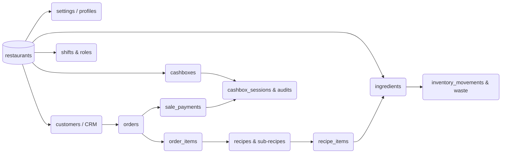

# Visión & Roadmap (Top Mundial) - Jamali OS

Jamali OS no es solo un software de caja, es un **Sistema Inteligente de Predicción y Gestión de Rentabilidad**. 
El objetivo es llevar el software a un estándar Top Mundial comparable a grandes empresas de la industria (Toast, Lightspeed, Square, Poster, Vendty, Fudo), pero con un **diferenciador tecnológico nativo**: Inteligencia Artificial integrada y un modelo Cloud (Multi-Tenant) escalable a nivel global.

## 📌 1. Mapa de Categorías y Módulos POS (Visión Enterprise 300+)
Las categorías y módulos priorizados que componen la base de Jamali OS y que justifican una valoración empresarial de +$200k USD:

| Categoría | Módulos Clave (Ejemplos) | Prioridad |
| --- | --- | --- |
| **POS / Ventas** | Orden rápida, mesa digital, split bills, multi-pagos, QR en mesa, comandas KDS. | **Alta** |
| **Inventario & Compras** | Stock Real-Time, stock Min/Max, mermas $, trazabilidad insumos, inventario cíclico, alertas proveedores. | **Alta** |
| **Recetas & Food Cost** | Sub-recetas, cálculo exacto de margen de plato (Food Cost), análisis rentabilidad. | **Alta** |
| **Caja & Finanzas** | Sesiones de caja (Cierre ciego), auditoría por turnos, conciliación, Petty Cash (Caja Menor). | **Alta** |
| **Reportes & Analytics**| Dashboard B.I., ventas v/s costos v/s nómina, desempeño de meseros, exportación PDF/Excell. | **Alta** |
| **Empleados & Laboral** | Control de acceso estricto (RLS, Pines), turnos, liquidaciones, productividad, logs de auditoría. | **Alta** |
| **Administración & Seg.**| Multi-Tenant profundo (`restaurant_id`), Backups, Facturación Electrónica DIAN, RLS DB. | **Alta** |
| **Delivery & Logística** | Rastreo, apps integradas (Rappi/UberEats), asignación de motorizados. | Alta |
| **Clientes & CRM** | Segmentación, historial, puntos/loyalty, campañas WhatsApp/n8n automáticas. | Media/Alta |
| **Reservas & Salón** | Plano drag & drop, timers de mesas, zonas / sectores. | Media |
| **AI & Futuro Premium** | Kiosco, App de dueño, **Forecasting de demanda, Sugerencias de Compras AI**, integraciones. | Baja (pero diferencial) |

---

## 🗺️ 2. Roadmap Exacto de Escalabilidad
Fases para llevar a Jamali OS a la dominancia del mercado:

### Fase 1: Base Sólida (Meses 0–3) *[FASE ACTUAL]*
- [x] Arquitectura SaaS Multi-Tenant (Seguridad RLS).
- [x] Dashboard Financiero visual (Food Cost y Mermas).
- [ ] Construcción de un POS (Punto de Venta) robusto, rápido y fluido (Animaciones Framer Motion).
- [ ] Flujo impecable Mesero -> Cocina (KDS) -> Caja.
- [ ] Facturación Electrónica (DIAN), modo Offline (PWA) de emergencia.

### Fase 2: Integración y Ecosistema (Meses 3–6)
- [ ] Centralización de Delivery (Rappi, UberEats, WhatsApp).
- [ ] Automatización de flujos de mensajes (Bots) vía n8n (Confirmar reservas, enviar menús).
- [ ] Integración física de pagos (Datáfonos QR, links de pago).

### Fase 3: Experiencia (Meses 6–9)
- [ ] Carta Digital interactiva / Pedidos QR desde la mesa.
- [ ] Plano de Salón interactivo (Drag & Drop).
- [ ] App móvil nativa (o PWA premium) de monitoreo para los Inversores/Dueños.
- [ ] Fidelización (Puntos Pargo, Cupones automáticos).

### Fase 4: Inteligencia y Diferenciación (Meses 9–12) 🧠
El núcleo de la "AI Predictiva" detallado en la sección 3.

### Fase 5: Dominio Mundial (>12 meses)
- [ ] Kioscos de Autoservicio (Fast Food Mode).
- [ ] API Pública abierta para integradores.
- [ ] Suscripciones y facturación automatizada SaaS (Freemium, Premium, Enterprise).

---

## 🧠 3. Sistema de Inteligencia Artificial (El "Moat" o Foso Económico)
Ningún POS tradicional de gama baja/media tiene esto. Jamali OS logrará predecir el comportamiento del restaurante analizando en el backend:

1. **Forecasting (Predicción de Demanda):**
   - *"Se espera un pico de +18% el próximo jueves por histórico del mes".* (Módulo Reportes).
   - Ajuste de prep-recipes: Sugerirle al Chef cuánta cebolla picar antes del turno de la noche.

2. **Control Anti-Pérdidas y Mermas (Anomaly Detection):**
   - Alertar al dueño vía WhatsApp si el "Cajero A" está haciendo demasiados descuentos o anulaciones en la misma hora.
   - Detectar si un insumo (Ej: Queso) está siendo mermado en cantidades irracionales.

3. **Upsell Asistido al Mesero (Copilot):**
   - En el POS visual, cuando un cliente pide "Nachos", sugerir automáticamente la "Margarita Especial" basándose en el porcentaje más alto histórico de combos (Cross-sell).

4. **Benchmarking de Rentabilidad:**
   - La AI te avisa si el Food Cost del "Pargo Rojo Frito" pasó el 33% del margen de ganancias por el alza del proveedor en `purchases`.

---

## 🔗 4. Mapa Ideal de BD Multi-Tenant (Implementado)
Jamali OS respeta el principio SaaS: *Todas las ramas nacen del árbol del Inquilino (`restaurants`)*. Todo tiene RLS, `created_at` y `user_id`.

