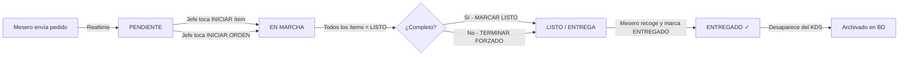

# 👨‍🍳 Manual de Cocina — KDS PRO
> **Módulo:** Kitchen Display System | **Ruta:** `/admin/kitchen`  
> **Versión:** 2.0 | **Última revisión:** 07 Marzo 2026  
> **Audiencia:** Chef, Jefe de Cocina, Auxiliar de Cocina

---

## ¿Qué es el KDS?

El **Kitchen Display System (KDS PRO)** es el cerebro visual de la cocina. Reemplaza las comandas en papel por un monitor táctil en tiempo real. Cada pedido que un mesero envía desde el Portal Waiter aparece **automáticamente** aquí en segundos, sin que nadie tenga que imprimir ni gritar nada.

> [!IMPORTANT]
> El KDS se sincroniza con la base de datos mediante **Supabase Realtime**. Cualquier cambio que hagas aquí (marcar un ítem como listo, iniciar una orden) se refleja **al instante** en el portal del mesero y en el dashboard del administrador.

---

## 1. CÓMO ENTRAR AL KDS

1. Inicia sesión en el sistema con tu usuario y contraseña.
2. Desde el **Dashboard Admin** (`/admin`), haz clic en la tarjeta **"KDS COCINA"**.
3. También puedes acceder directamente desde la URL: `http://[tu-dominio]/admin/kitchen`.

> [!TIP]
> El KDS está diseñado para pantallas grandes (TV o monitor de cocina) en orientación horizontal. Configura el navegador en **modo pantalla completa** (F11) para la mejor experiencia operativa.

---

## 2. ANATOMÍA DE LA PANTALLA

La pantalla del KDS está dividida en 4 zonas principales:

```
┌─────────────────────────────────────────────────────────────────────┐
│  ENCABEZADO: KDS PRO | Filtro Estaciones | Contador | Botones       │
├─────────────────┬─────────────────────┬─────────────────────────────┤
│  PENDIENTES     │   EN MARCHA         │   LISTO / ENTREGA           │
│  (Cola)         │   (En Preparación)  │   (Listo para despachar)    │
│                 │                     │                             │
│  Tarjeta #1     │   Tarjeta #3        │   Tarjeta #5                │
│  Tarjeta #2     │   Tarjeta #4        │                             │
└─────────────────┴─────────────────────┴─────────────────────────────┘
```

### 2.1 El Encabezado

| Elemento | Descripción |
|----------|-------------|
| **"KDS PRO"** | Título del módulo. El punto verde parpadeante indica que el Realtime está activo. |
| **Selector de Estaciones** | Botones para filtrar por estación (Parrilla, Bebidas, Entradas, etc.) o ver TODAS. |
| **"X EN MARCHA"** | Contador en tiempo real de órdenes que están actualmente en preparación. |
| **RESUMEN** | Abre el panel lateral de Resumen de Producción consolidado. |
| **STOCK** | Abre el modal de Gestor de Stock para marcar productos agotados. |
| **🔊 / 🔇** | Activa o silencia las alertas sonoras del KDS. |
| **← (Flecha atrás)** | Regresa al Dashboard Administrativo. |

### 2.2 Las Tres Columnas Kanban

El tablero usa un sistema **Kanban de 3 estados**:

| Columna | Estado en BD | Significado |
|---------|-------------|-------------|
| **PEDIDOS PENDIENTES** | `pending` | Orden recibida, nadie la ha tocado aún. |
| **ÓRDENES EN MARCHA** | `preparing` | Un cocinero la inició. Está en el fogón. |
| **LISTO / ENTREGA** | `ready` | Completada, esperando al mesero para recoger. |

El número en la esquina derecha de cada encabezado de columna indica cuántas órdenes hay en ese estado.

---

## 3. LA TARJETA DE PEDIDO — Guía Detallada

Cada orden aparece como una **tarjeta**. Esta es la unidad de trabajo del cocinero.

```
┌─────────────────────────────────────────────┐
│  🏷️ Mesa #5          ⏱ 3:42    📦 0/3       │  ← Encabezado
│  ████░░░░░░░░░░░░░░░░░░░░░░░  (barra)       │  ← Progreso
│  [ Ver Pedido Completo 🔥 ]                │  ← Expandir
│                                             │
│  (desplegado)                              │
│  ─────────────────────────────────────────  │
│  2X  HAMBURGUESA CLÁSICA  [INICIAR →]      │
│  1X  PAPAS FRITAS         [✓ LISTO]        │
│  1X  REFRESCO COLA        [INICIAR →]      │
│                                             │
│  🔔 Nota: sin cebolla, bien cocida         │  ← Nota del ítem
│  📌 Nota general: cliente alérgico...      │  ← Nota de la orden
│                                             │
│  [ ▶ INICIAR ESTA ORDEN ]  ó  [TERMINAR]   │  ← Acción principal
└─────────────────────────────────────────────┘
```

### 3.1 Indicadores de Tiempo (Semáforo)

El borde de la tarjeta y el reloj cambian de color según el tiempo transcurrido:

| Color | Tiempo | Significado | Acción Recomendada |
|-------|--------|-------------|-------------------|
| 🟢 **Verde** | 0 – 4 min | Normal, sin urgencia | Trabaja al ritmo habitual |
| 🟠 **Naranja** | 5 – 9 min | Alerta temprana | Prioriza si puedes |
| 🔴 **Rojo parpadeante** | 10+ min | ¡CRÍTICO! Retraso severo | Actúa de inmediato. El sistema enviará alerta sonora. |

> [!CAUTION]
> Cuando una orden lleva **10 minutos o más** en estado `pending` o `preparing`, el KDS emite un **pitido de alerta** cada 30 segundos (si el sonido está activado) y muestra un toast rojo de aviso en pantalla.

### 3.2 El Campo Nota de Ítem (Naranja)

Si un ítem tiene una nota especial del cliente (ej: `"SIN CEBOLLA"`, `"TÉRMINO MEDIO"`), aparece un bloque naranja debajo del ítem:

```
🗒️  SIN CEBOLLA — TÉRMINO MEDIO
```

Este campo nunca debe ignorarse. El mesero lo escribió porque el cliente lo solicitó.

### 3.3 La Nota General de la Orden (Ámbar)

Si toda la orden tiene una nota (ej: `"Cliente alérgico al gluten"`), aparece un bloque ámbar con ícono de campana **al final de la tarjeta expandida**. Es información crítica de toda la mesa, no de un ítem en particular.

### 3.4 Barra de Progreso

La barra horizontal muestra qué porcentaje de ítems de la orden ya están marcados como **LISTO**:
- Barra **naranja**: en proceso (no todos están listos)
- Barra **verde brillante** con efecto glow: ¡todos los ítems están listos! Momento de marcar la orden completa.

---

## 4. FLUJO DE TRABAJO PASO A PASO

### Paso 1 — Nueva Orden Entra a Cocina

1. El mesero envía la orden desde su portal.
2. Suenas escucha: **🔔 "ding" suave** en el KDS.
3. Aparece una **tarjeta nueva** en la columna **PENDIENTES** (borde verde).
4. Un toast en pantalla dice **"¡NUEVA COMANDA ENTRANTE!"**

> Si la tarjeta tiene una insignia dorada **⭐ PRIORIDAD VIP**, esta orden se coloca automáticamente al **inicio de la cola**, por encima de las demás.

---

### Paso 2 — Revisar y Expandir la Tarjeta

1. Toca el botón **"Ver Pedido Completo 🔥"** (animado con rebote).
2. La tarjeta se expande y muestra todos los ítems con sus cantidades y notas.
3. Verifica si hay alertas naranjas (ítems sin iniciar dentro de una orden en marcha).

---

### Paso 3 — Iniciar Ítems Individualmente

Para cada ítem en la tarjeta expandida:

1. Presiona el botón **[INICIAR →]** junto al ítem que vas a preparar.
2. El ítem cambia a estado **"preparando"** (fondo naranja, escala ligeramente).
3. **Automatización inteligente**: Si la orden estaba en `pending` y tocas INICIAR en cualquier ítem, la orden **entera pasa automáticamente a "EN MARCHA"** (columna central). No tienes que hacer nada extra.
4. Cuando un ítem está listo, toca el botón **[✓ LISTO]** (verde).
5. El ítem aparece tachado y con opacity reducida.

---

### Paso 4 — Marcar la Orden Completa como Lista

Una vez que todos los ítems están en verde:

**Opción A — Todos los ítems completos (recomendado):**
- El botón de acción muestra **"✓ MARCAR TODO LISTO"** en verde brillante.
- Tócalo. La tarjeta se mueve a la columna **LISTO / ENTREGA**.
- El mesero recibe notificación inmediata en su portal.

**Opción B — Forzar el cierre aunque queden ítems:**
- El botón muestra **"⏭ TERMINAR FORZADO"** en naranja.
- Úsalo solo si un ítem se canceló verbalmente o no se puede servir.
- La orden pasa igual a LISTO para que el mesero pueda recoger lo que hay.

---

### Paso 5 — Entrega al Mesero

1. El mesero recoge los platos y toca **"ENTREGAR A MESERO"** desde su portal (o el botón en la columna LISTO del KDS).
2. La tarjeta **desaparece del KDS** por completo.
3. La orden queda en estado `delivered` en la base de datos para auditoría.

---

## 5. FILTRO POR ESTACIÓN DE PRODUCCIÓN

### ¿Para qué sirve?

Si el restaurante tiene estaciones separadas (ej: **Parrilla**, **Bebidas**, **Entradas**), cada monitor puede configurarse para ver solo sus pedidos.

### Cómo usarlo:

1. En el encabezado, busca la barra de botones de estaciones.
2. Toca la estación de tu área (ej: **PARRILLA**).
3. El KDS mostrará solo los ítems que el administrador asignó a esa estación en la configuración de productos.
4. Toca **TODAS** para ver el board completo nuevamente.

> [!NOTE]
> Las estaciones se crean en **Admin → Configuración → Estaciones de Producción** (`/admin/settings`). Cada producto del menú puede tener asignada una estación. Si un producto no tiene estación asignada, solo aparece en la vista **TODAS**.

---

## 6. PANEL DE RESUMEN DE PRODUCCIÓN

### ¿Para qué sirve?

El **Resumen Total** consolida todos los ítems pendientes de todas las órdenes activas en una sola lista. Perfecto para preparar en lote al inicio de un turno fuerte.

**Ejemplo de vista:**
```
RESUMEN TOTAL
──────────────────────────
HAMBURGUESA CLÁSICA  →  8x
PAPAS FRITAS         → 12x
REFRESCO COLA        →  5x
```

### Cómo abrirlo:

1. Pulsa el botón **"RESUMEN"** (negro) en el encabezado.
2. Se desliza un panel lateral desde la derecha.
3. Úsalo de referencia mientras cocinas. No muestra ítems que ya están en estado `ready`.
4. Ciérralo tocando la flecha **"←"** dentro del panel.

---

## 7. GESTOR DE STOCK (MARCAR AGOTADOS)

### ¿Para qué sirve?

Si un ingrediente o producto se acaba en cocina, puedes bloquearlo **al instante** sin salir del KDS. El sistema lo oculta o deshabilita en el portal del mesero de forma inmediata.

### Paso a paso:

1. Presiona el botón **"STOCK"** (blanco con borde) en el encabezado.
2. Se abre un modal con todos los productos del menú.
3. Usa la barra de búsqueda para encontrar rápido el producto.
4. **Un toque = cambiar el estado:**
   - Si está **disponible** (verde ✓) → toca para marcarlo **AGOTADO** (rojo, tono de advertencia).
   - Si está **agotado** (rojo) → toca para **reactivarlo** (verde).
5. Verás un toast de confirmación: **"STOCK ACTUALIZADO"**.
6. El mesero verá el producto bloqueado en tiempo real.

> [!CAUTION]
> Esta acción es inmediata y global. Al marcar un producto como AGOTADO, ningún mesero podrá agregarlo a ningún pedido nuevo hasta que lo reactives. Úsalo con precaución.

---

## 8. SISTEMA DE ALERTAS SONORAS

El KDS tiene dos tipos de sonidos:

| Sonido | Cuándo suena | Descripción |
|--------|-------------|-------------|
| 🔔 **Ding suave** | Llega una nueva orden | Aviso amigable de nueva comanda |
| 🚨 **Alerta intensa** | Orden con 10+ minutos sin completarse | Pitido urgente cada 30 segundos |

### Cómo activar/silenciar:

- Presiona el ícono **🔊 (altavoz verde)** para silenciar → cambia a **🔇 (rojo)**.
- Presiona de nuevo para reactivar el sonido.

> [!NOTE]
> Los navegadores modernos bloquean el audio automático hasta que el usuario interactúa con la página. Si el KDS acaba de cargar, haz un toque en cualquier parte de la pantalla para habilitar el audio. Si el sonido sigue sin funcionar, verifica que el volumen del sistema no esté al mínimo.

---

## 9. AUTOMATIZACIONES INTELIGENTES DEL KDS

El sistema hace varias cosas automáticamente para reducir clics:

| Automatización | Cuándo ocurre | Resultado |
|---------------|--------------|-----------|
| **Auto-inicio de orden** | Tocas INICIAR en cualquier ítem de una orden `pending` | La orden entera pasa a `preparing` automáticamente |
| **Alerta de ítems olvidados** | Una orden está en `preparing` pero hay ítems sin iniciar | Aparece banner naranja pulsante de advertencia dentro de la tarjeta |
| **Barra verde completa** | Todos los ítems están en `ready` | El botón cambia a "MARCAR TODO LISTO" en verde |
| **VIP al frente** | Un pedido tiene campo `priority: true` | Se ordena primero en todas las columnas, con insignia dorada |
| **Alerta de retrasados** | Orden con 10+ min en `pending` o `preparing` | Borde rojo pulsante + sonido de alerta cada 30 seg |

---

## 10. CASOS COMUNES Y SOLUCIONES

| Situación | Solución |
|-----------|----------|
| **No llegan órdenes al KDS** | 1. Verifica tu conexión a internet. 2. Recarga la página (F5). 3. El punto verde "Live Sync" debe estar parpadeando. |
| **El sonido no funciona** | Toca cualquier parte de la pantalla para habilitar audio. Verifica que el ícono no sea el rojo (silenciado). |
| **Hay una orden vieja atascada en "En Marcha"** | Expande la tarjeta y usa el botón **"TERMINAR FORZADO"** para moverla a LISTO. |
| **Un producto se acabó** | Usa el **Gestor de Stock** (botón STOCK) para marcarlo AGOTADO al instante. |
| **La estación no aparece en el filtro** | El admin debe crear estaciones en **Configuración → Estaciones** y asignarlas a los productos. |
| **Una tarjeta dice "H" en vez del número de mesa** | El pedido es de domicilio o para llevar (sin mesa asignada). La "H" significa "Hora / Pickup". |
| **Veo una insignia ⭐ amarilla** | Es un pedido VIP/urgente. El mesero lo marcó como prioritario. Atiéndelo primero. |
| **Hay un banner naranja pulsante dentro de una tarjeta** | Hay ítems sin iniciar en una orden que ya está "En Marcha". Expande y toca INICIAR en los que faltan. |

---

## 11. BUENAS PRÁCTICAS PARA EL JEFE DE COCINA

1. **Al inicio del turno**: Revisa el Gestor de Stock y marca como AGOTADO todo lo que no haya llegado en el pedido de la mañana. Evita frustraciones durante el servicio.
2. **Configura los filtros de estación**: Pídele al admin que configure las estaciones y asigne cada producto. Así cada puesto de trabajo solo ve lo que le corresponde.
3. **Nunca silencies el sonido en hora pico**: Las alertas sonoras son la primera línea de defensa contra los retrasos.
4. **Usa "TERMINAR FORZADO" solo en emergencias**: Si fuerzas el cierre con ítems sin terminar, el mesero recibirá el pedido como completo y puede llevar una mesa incompleta al cliente.
5. **El Resumen de Producción es tu aliado**: Ábrelo antes de que llegue la hora pico para saber cuánto producir en lote (ej: 20 hamburguesas anticipadas).

---

## 12. FLUJO COMPLETO — DIAGRAMA DE ESTADOS



---

> [!IMPORTANT]
> **Regla de oro del KDS:** Nunca cierres o refrescu el navegador en medio del turno sin necesidad. El KDS mantiene la sincronización activa. Un recargo innecesario puede causar un breve lapso de 1-2 segundos donde nuevas órdenes no se escuchan.

---

*Manual generado con base en el código fuente de `src/app/admin/kitchen/page.tsx` — Versión 2.0 | JAMALI SO OS · Antigravity Platform*
