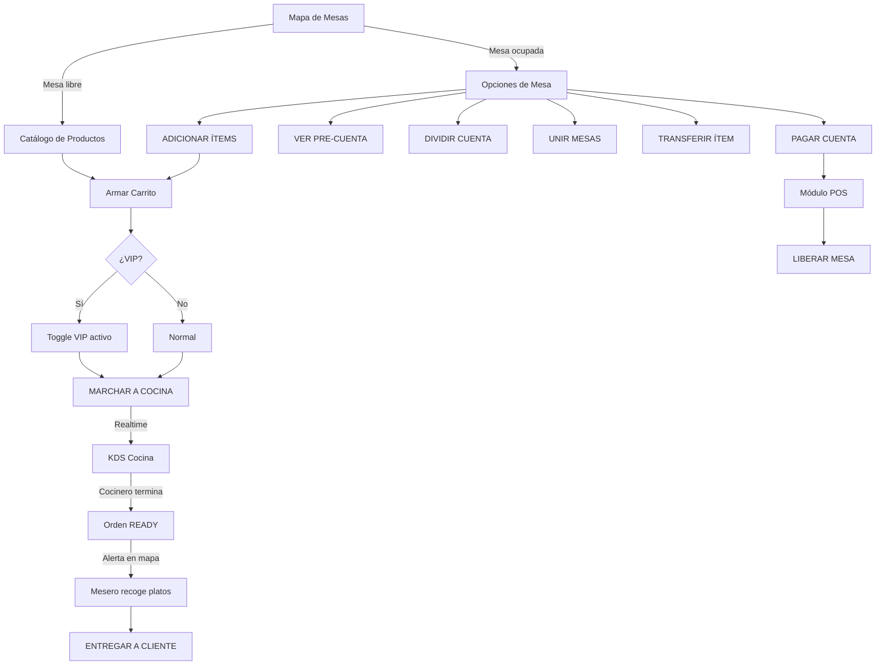

# 👨‍💼 Manual del Portal de Mesero — WAITER PRO
> **Módulo:** Waiter Pro | **Ruta:** `/admin/waiter`  
> **Versión:** 2.0 | **Última revisión:** 07 Marzo 2026  
> **Audiencia:** Mesero, Capitán de Salón, Hostess

---

## ¿Qué es el Waiter Pro?

El **Portal Waiter Pro** es la herramienta de trabajo del mesero. Desde aquí toma pedidos, gestiona el salón, divide cuentas y coordina con cocina — todo desde un celular o tablet, sin papel ni radio.

> [!IMPORTANT]
> Toda acción se sincroniza en tiempo real. Al enviar una comanda, el KDS de cocina la recibe en segundos. Al marcar una orden como entregada, la mesa se libera en el mapa automáticamente.

---

## 1. CÓMO ENTRAR AL PORTAL

1. Inicia sesión en el sistema con tu usuario asignado.
2. Desde el Dashboard Admin, toca la tarjeta **"POS VENTA"** o **"WAITER"**, según cómo esté configurado tu rol.
3. También puedes acceder directamente a: `http://[tu-dominio]/admin/waiter`

> [!TIP]
> El portal está optimizado para **móvil y tablet** en orientación vertical. Es tu herramienta de salón. Agrégala a la pantalla de inicio del teléfono como acceso directo.

---

## 2. ANATOMÍA DE LA PANTALLA

El portal tiene **3 vistas** que se navegan secuencialmente:

```
VISTA 1: GESTIÓN DE SALÓN (mapa de mesas)
    ↓ Toca una mesa
VISTA 2a: OPCIONES DE MESA (si está ocupada)
    ↓ Toca "Adicionar Ítems" o "Nueva Orden"
VISTA 2b: TOMAR PEDIDO (catálogo + carrito)
    ↓ Presiona "Marchar a Cocina"
VISTA 1: Regresa al mapa
```

### Encabezado (siempre visible)

| Elemento | Descripción |
|----------|-------------|
| **← (flecha)** | Vuelve a la vista anterior (solo aparece si no estás en el mapa) |
| **WAITER PRO** | Título del módulo |
| **💬 (chat)** | Abre el modal para enviar mensajes rápidos a Cocina |
| **🟢 LIVE SYNC** | Punto verde parpadeante = conexión Realtime activa |

---

## 3. VISTA 1 — GESTIÓN DE SALÓN (Mapa de Mesas)

Esta es la pantalla de inicio. Muestra todas las mesas del restaurante en una cuadrícula.

### 3.1 Indicadores visuales de cada mesa

| Color / Estado | Significado |
|---------------|-------------|
| **Verde suave** (fondo esmeralda) | Mesa **DISPONIBLE** — libre para asignar |
| **Blanco con borde naranja** | Mesa **OCUPADA** — tiene una orden activa |
| **Borde verde pulsante** | Orden marcada como **READY** — ¡los platos están listos! Recógelos. |
| **Borde rojo pulsante** | Mesa lleva **+20 minutos** sin resolver — ¡CRÍTICO! |
| **Borde dorado (⭐)** | Orden marcada como **VIP/Prioritaria** |
| **Icono de alerta (🔴)** superpuesto | Tiempo crítico — el cliente lleva mucho esperando |

### 3.2 Información dentro de cada tarjeta de mesa

- **Número en la esquina** (naranja/verde): Capacidad de la mesa (número de sillas).
- **Badge "BUSY" / "READY"**: Estado de la orden en tiempo real.
  - 🟠 **BUSY**: En preparación.
  - 🟢 **READY**: Lista para entregar. La tarjeta rebota.
- **Tiempo transcurrido** (ej: `12m`): Minutos desde que se tomó la orden.
- **Monto acumulado** (ej: `$145.000`): Total actual de la orden de esa mesa.
- **⭐**: Orden prioritaria VIP.

### 3.3 Cómo interactuar con las mesas

| Acción | Resultado |
|--------|-----------|
| Tocar mesa **libre** | Abre directamente la vista de "Tomar Pedido" |
| Tocar mesa **ocupada** | Abre la vista de "Opciones de Mesa" |
| Tocar mesa en **modo fusión activo** | Fusiona la mesa origen con la mesa tocada |

### 3.4 Contadores en el encabezado del mapa

Arriba a la derecha ves dos chips:
- **"X Libres"** (gris): cuántas mesas están disponibles.
- **"X Ocupadas"** (naranja): cuántas mesas tienen servicio activo.

---

## 4. VISTA 2a — OPCIONES DE MESA (Mesa Ocupada)

Al tocar una mesa ocupada, aparece este menú central con 6 acciones:

```
┌─────────────────┬──────────────────┐
│  + ADICIONAR    │  📋 VER          │
│    ÍTEMS        │     PRE-CUENTA   │
├─────────────────┼──────────────────┤
│  🔗 UNIR        │  ↔ DIVIDIR       │
│     MESAS       │    CUENTA        │
├─────────────────┼──────────────────┤
│  📡 TRANSFERIR  │  💳 PAGAR        │
│     ÍTEMS       │     CUENTA       │
└─────────────────┴──────────────────┘
           [ENTREGAR A CLIENTE]    ← solo si está READY
             [LIBERAR MESA]
```

---

## 5. VISTA 2b — TOMAR PEDIDO (Catálogo + Carrito)

Esta vista tiene 3 zonas:

```
┌──────────────────────────────────────────────────────┐
│  [TOP 5 Quick-Add]  [🔍 Buscar en menú...]           │ ← Barra superior
├────┬─────────────────────────────────────┬───────────┤
│    │   CATÁLOGO DE PRODUCTOS             │  CARRITO  │
│ C  │   ┌──────┐ ┌──────┐ ┌──────┐       │  (desktop)│
│ A  │   │Hamb. │ │Papas │ │Refre │       │           │
│ T  │   │$15k  │ │$8k   │ │$5k   │       │           │
│    │   └──────┘ └──────┘ └──────┘       │           │
├────┴─────────────────────────────────────┴───────────┤
│  [⭐ PEDIDO VIP] ──── [MARCHAR A COCINA]              │ ← Nav móvil
└──────────────────────────────────────────────────────┘
```

---

## 6. FLUJO COMPLETO — TOMAR UN PEDIDO NUEVO

### Paso 1 — Seleccionar mesa libre

1. En el mapa, toca la mesa libre del cliente.
2. La apps salta directamente al catálogo de productos.

---

### Paso 2 — Agregar productos al carrito

**Opción A — Quick-Add (más rápido):**
- La barra superior muestra los **primeros 5 productos** del menú como botones de acceso rápido.
- Toca **"+ [Nombre]"** para agregarlo instantáneamente al carrito.

**Opción B — Catálogo por categorías:**
- En el panel izquierdo, selecciona una categoría (Entradas, Parrilla, Bebidas...).
- Toca la tarjeta del producto en la cuadrícula central.
- El producto se agrega al carrito con un toast de confirmación.

**Opción C — Búsqueda:**
- Escribe el nombre del plato en la barra de búsqueda.
- El catálogo filtra en tiempo real.

> [!NOTE]
> Los productos marcados como **AGOTADO** (por cocina desde el KDS) aparecen con un sello rojo diagonal y **no se pueden tocar**. No intentes dárselos al cliente.

---

### Paso 3 — Personalizar ítems del carrito (Desktop)

En el panel derecho (visible solo en tablets y computadores grandes), cada ítem del carrito tiene:

**Modificadores Rápidos (chips):**  
Toca uno o más para agregarlo como nota del ítem:
```
[SIN CEBOLLA] [TÉRMINO MEDIO] [BIEN ASADO]
[EXTRA QUESO] [SIN SAL]       [PARA LLEVAR]
```

**Campo de nota libre:**  
Escribe cualquier indicación especial del cliente (ej: `"alergico a la crema"`).

**Botones `+` / `-`:**  
Ajusta la cantidad del ítem (mínimo 1). 

**Botón `✕`:**  
Elimina el ítem completamente del carrito.

---

### Paso 4 — (Opcional) Marcar como VIP

Si el cliente es especial o hay urgencia:

1. Activa el toggle **"PEDIDO VIP / PRIORITARIO"** (estrella dorada).
2. El toggle se ilumina en ámbar.
3. Al marchar, la orden llegará al KDS con la insignia ⭐ y se colocará al **inicio de la cola**, por encima de las demás.

---

### Paso 5 — Ver el resumen de precios

En el panel derecho del carrito (desktop) verás **automáticamente**:

| Línea | Descripción |
|-------|-------------|
| **SUBTOTAL** | Suma de todos los productos sin impuestos |
| **IMPUESTOS (X%)** | Calculado con el % configurado por el administrador |
| **SERVICIO (X%)** | Solo aparece si el restaurante tiene cargo de servicio activo |
| **TOTAL FINAL** | Lo que el cliente pagará. Grande y en naranja. |

> [!NOTE]
> Los porcentajes de impuesto y servicio son automáticos. El admin los configura en **Configuración del Negocio**. El mesero no los modifica.

---

### Paso 6 — Marchar la comanda a cocina

1. Toca el botón grande naranja: **"MARCHAR A COCINA"** (o **"MARCHAR ORDEN VIP"** si está activo el toggle).
2. El botón muestra un spinner mientras procesa.
3. El sistema:
   - Crea la orden en la base de datos con todos los ítems y notas.
   - Calcula impuestos y servicio automáticamente.
   - Actualiza el estado de la mesa a **OCUPADA**.
   - El KDS de cocina recibe la orden en tiempo real con un "ding".
4. Regresa automáticamente al mapa de mesas.

---

## 7. FUNCIONES AVANZADAS DE MESA OCUPADA

### 7.1 Adicionar Ítems a una Orden Existente

Si el cliente pide algo más después de enviar la comanda inicial:

1. Toca la mesa ocupada → **"ADICIONAR ÍTEMS"**.
2. Se abre el catálogo nuevamente, con el carrito vacío.
3. Agrega los productos nuevos.
4. Toca **"MARCHAR A COCINA"**.
5. Los ítems nuevos se agregan a la **misma orden activa** de esa mesa.

---

### 7.2 Ver Pre-Cuenta

Para mostrar el borrador al cliente antes del cobro formal:

1. Toca la mesa → **"VER PRE-CUENTA"**.
2. Se abre un modal estilo ticket térmico con:
   - Nombre del restaurante.
   - Número de mesa y fecha.
   - Lista completa de ítems consumidos con cantidades y subtotales.
   - Total de la orden.
   - Leyenda: *"Este documento no es una factura válida."*
3. Botón **🖨️**: imprime el ticket con `window.print()`.
4. Botón **CERRAR**: cierra el modal.

---

### 7.3 Unir Mesas (Merge)

Cuando dos grupos de clientes quieren pagar juntos o sentarse juntos:

1. Toca la mesa que quieres **MOVER** → **"UNIR MESAS"**.
2. El mapa vuelve a aparecer con las mesas disponibles pulsando en añil.
3. El encabezado muestra: *"SELECCIONA MESA DESTINO"*.
4. Toca la mesa destino (debe estar **ocupada con orden activa**).
5. El sistema fusiona ambas órdenes en la mesa destino.
6. La mesa origen queda liberada automáticamente.

Para cancelar antes de seleccionar la destino, toca el botón **"CANCELAR UNIÓN"** (rojo).

> [!CAUTION]
> Solo puedes unir dos mesas que **ambas tengan órdenes activas**. No se puede unir una mesa libre con una ocupada usando esta función.

---

### 7.4 Dividir Cuenta (Split Check)

Cuando los clientes quieren pagar por separado:

1. Toca la mesa → **"DIVIDIR CUENTA"**.
2. Se abre el modal de división. Verás todos los ítems de la orden actual.
3. **Toca los productos** que quieres separar. Los seleccionados se resaltan en naranja con un ✓.
4. Toca **"MOVER A NUEVA CUENTA"**.
5. El sistema crea una **segunda orden nueva** con los ítems seleccionados.
6. Ambas cuentas quedan activas y separadas en la base de datos.

> [!IMPORTANT]
> Debes seleccionar **al menos un ítem** para poder ejecutar la división. El botón "MOVER A NUEVA CUENTA" estará bloqueado hasta que selecciones algo.

---

### 7.5 Transferir Ítem a Otra Mesa

Cuando un producto fue enviado a la mesa equivocada:

1. Toca la mesa de origen → **"TRANSFERIR ÍTEMS"**.
2. Se abre el modal de transferencia en **Paso 1: Selecciona el ítem**.
3. Toca el producto que quieres mover. Se resalta en índigo.
4. El modal avanza a **Paso 2: Selecciona la mesa destino**.
5. Toca la mesa a la que va el ítem.
6. El ítem se mueve a la orden de la mesa destino instantáneamente.

Si te equivocas en el ítem, toca **"VOLVER"** para reseleccionar. Para cancelar todo, toca **"CANCELAR"**.

---

### 7.6 Pagar Cuenta

1. Toca la mesa → **"PAGAR CUENTA"**.
2. Te redirige al **módulo POS** (`/admin/pos`) con la mesa preseleccionada.
3. Allí el cajero procesa el pago en efectivo, tarjeta u otro método.

---

### 7.7 Entregar al Cliente (Orden READY)

Cuando el KDS marca la orden como lista, la tarjeta de la mesa:
- Muestra el badge **"READY"** en verde pulsante.
- Aparece una barra verde animada en la parte superior.
- En la vista de Opciones de Mesa, aparece el botón grande:

**"✓ ENTREGAR A CLIENTE (PEDIDO LISTO)"** — en verde brillante, con animación de rebote.

1. Recoge los platos de cocina.
2. Llévalos a la mesa.
3. Toca el botón verde.
4. La orden pasa a estado `delivered` → desaparece del KDS → la mesa sigue ocupada hasta que el cliente pague.

---

### 7.8 Liberar Mesa

Cuando el cliente se va **sin pasar por caja** (ej: cuenta ya fue procesada por el cajero, o mesa cancelada):

1. Toca la mesa → **"LIBERAR MESA"** (botón rojo al final).
2. Aparece una confirmación: *"¿LIBERAR MESA?"*
3. Confirma → la mesa vuelve a estado **libre** (verde) en el mapa.

> [!CAUTION]
> Liberar una mesa **no cancela ni cobra** la orden. Úsalo solo cuando el pago ya fue procesado por el cajero o cuando se cometió un error al asignar la mesa. Si hay una orden activa sin pagar, habla con el cajero primero.

---

## 8. CHAT CON COCINA

Para enviar mensajes urgentes al área de producción sin moverte del salón:

1. Toca el ícono **💬** en el encabezado.
2. Se abre el modal de Chat Cocina.
3. **Mensajes predefinidos (toca para seleccionar):**
   - `CUBIERTOS`
   - `LIMPIAR MESA`
   - `HIELO BAR`
   - `URGENTE`
4. O escribe un mensaje libre en el campo de texto.
5. Toca **"ENVIAR A COCINA"**.
6. El mensaje llega al sistema de notificaciones de cocina.

---

## 9. ALERTAS VISUALES — QUÉ SIGNIFICAN

| Señal visual en el mapa | Qué hacer |
|------------------------|-----------|
| Mesa roja pulsante + ícono ⚠️ | La mesa lleva +20 min atendida. Verifica el estado. |
| Badge "READY" verde en mesa | Los platos están listos. Ve a cocina a recogerlos. |
| Badge "BUSY" naranja | La orden está en preparación en cocina. Normal. |
| Mesa con ⭐ dorada | Orden VIP. Trata con máxima prioridad. |
| Mesa pulsando en añil | Modo Unir Mesas activo. Toca para fusionar. |

---

## 10. FLUJO COMPLETO — DIAGRAMA



---

## 11. CASOS COMUNES Y SOLUCIONES

| Problema | Solución |
|----------|----------|
| El catálogo no carga | Verifica conexión. Recarga la página. El punto "LIVE SYNC" debe estar verde. |
| Un producto no aparece | El admin puede haberlo desactivado. Pregunta en cocina o al admin. |
| Un producto dice AGOTADO | Cocina lo marcó desde el KDS. No puedes ofrecérselo al cliente. |
| Envié la comanda a la mesa equivocada | Usa **Transferir Ítem** para mover cada producto a la mesa correcta. |
| El mesero cerró sesión con órdenes activas | Las órdenes permanecen en la BD. Inica sesión nuevamente y las mesas siguen ocupadas. |
| La mesa está en rojo pero la orden ya se entregó | Toca la mesa → **Liberar Mesa** para restaurarla a verde. |
| Quiero agregar más comida a la misma mesa | Toca la mesa ocupada → **Adicionar Ítems** → nuevo carrito → Marchar. |
| El cliente quiere pagar por separado | Toca la mesa → **Dividir Cuenta** → selecciona los ítems de cada uno. |
| Necesito unir dos grupos en una sola cuenta | Toca una de las mesas → **Unir Mesas** → toca la otra mesa. |

---

## 12. BUENAS PRÁCTICAS DEL MESERO

1. **Confirma la mesa antes de marchar**: Revisa en el encabezado de la vista de pedido que el nombre de la mesa sea correcto.
2. **Usa los modificadores rápidos**: Los chips (SIN CEBOLLA, etc.) son más rápidos que escribir y evitan errores de escritura.
3. **Activa VIP con criterio**: Solo para pedidos realmente urgentes. Abusar del VIP afecta la prioridad de todos.
4. **Revisa el mapa frecuentemente**: El badge "READY" te avisa que tienen platos listos en cocina. No los dejes esperar.
5. **Libera mesas solo cuando el pago esté confirmado**: Una mesa liberada prematuramente puede perderse del control del cajero.
6. **Chat con cocina para urgencias reales**: No lo uses para mensajes triviales. Es un canal de emergencia operativa.

---

*Manual generado con base en el código fuente de `src/app/admin/waiter/page.tsx` — Versión 2.0 | JAMALI SO OS · Antigravity Platform*
